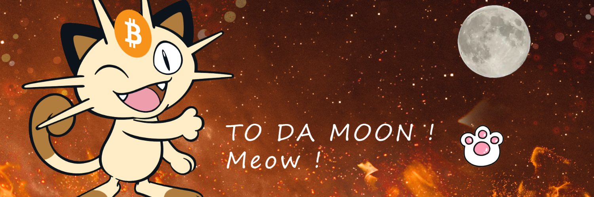

# Meow Meow Finance

## **Intro**

**Meow Meow Finance** Finance is a **decentralised exchange** running on Binance Smart Chain and Pancake swap exchange, with lots of other features that let you **earn and win tokens**.

What we are trying to do is create a perpetual deflation token, the **MEOWB**, that allows a constant price pump with a sufficient burn mechanism. We are not trying to replace the swap & exchange but to add value into the system and create a suitable and sustainable environment for people to yield farming with high APR.

## **Features**

**Earn**

*  We hope to create a **MEOWB** for everyone to farm from it! Earn **MEOWB**, and other coins \(to be determined\) while staking.

**Security**

* Timelock added to contract at launch
* Removed migrator code \(inherited from Pancake swap\)

**Layered Farming**

* Layered farming is a perpetual farming tool to allow you to constantly enjoy a high-risk high-reward APY yield farming. Imagine a new xxxxswap site but hosted on Meow Meow Finance where you can ape your money into it with no rugpull, no dumping, no hidden pool! 

